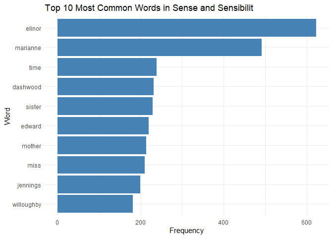
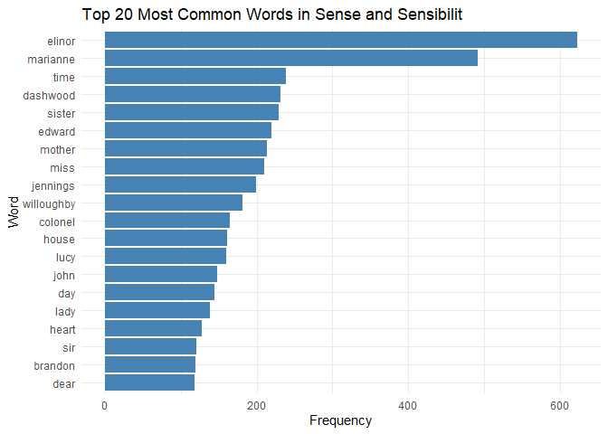
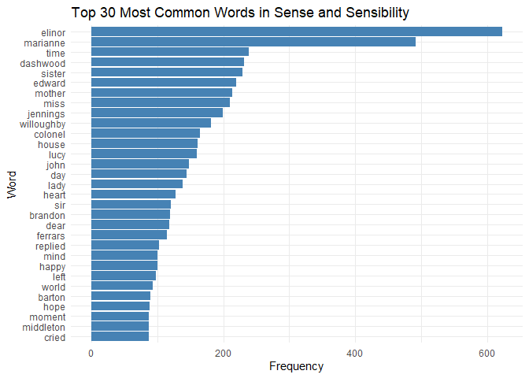

Assignment-B4-OptionA: Strings and Functional Programming in R
================
Ting Xu

# Instruction

This document is an implementation of **Option A** for the
assignment-b4, focusing on string manipulation and functional
programming in R. The exercises include text analysis (exercise 1), Pig
Latin conversion (exercise 2).

### Preparation and External Packages Used

For preparation, we install and load required R packages here at first.

``` r
# Load necessary libraries
library(janeaustenr)
```

    ## Warning: package 'janeaustenr' was built under R version 4.4.2

``` r
library(tidyverse)
```

    ## Warning: package 'ggplot2' was built under R version 4.4.2

    ## ── Attaching core tidyverse packages ──────────────────────── tidyverse 2.0.0 ──
    ## ✔ dplyr     1.1.4     ✔ readr     2.1.5
    ## ✔ forcats   1.0.0     ✔ stringr   1.5.1
    ## ✔ ggplot2   3.5.1     ✔ tibble    3.2.1
    ## ✔ lubridate 1.9.3     ✔ tidyr     1.3.1
    ## ✔ purrr     1.0.2     
    ## ── Conflicts ────────────────────────────────────────── tidyverse_conflicts() ──
    ## ✖ dplyr::filter() masks stats::filter()
    ## ✖ dplyr::lag()    masks stats::lag()
    ## ℹ Use the conflicted package (<http://conflicted.r-lib.org/>) to force all conflicts to become errors

``` r
library(tidytext)
```

    ## Warning: package 'tidytext' was built under R version 4.4.2

``` r
library(ggplot2)
library(purrr)
library(testthat)
```

    ## 
    ## Attaching package: 'testthat'
    ## 
    ## The following object is masked from 'package:dplyr':
    ## 
    ##     matches
    ## 
    ## The following object is masked from 'package:purrr':
    ## 
    ##     is_null
    ## 
    ## The following objects are masked from 'package:readr':
    ## 
    ##     edition_get, local_edition
    ## 
    ## The following object is masked from 'package:tidyr':
    ## 
    ##     matches

- `janeaustenr`: For accessing Jane Austen’s book, “Pride and
  Prejudice”.
- `tidyverse`: For general data manipulation and plotting.
- `tidytext`: For text mining tasks such as tokenization and stop-word
  removal.
- `purrr`: For functional programming and applying functions to groups
  of data.

# Exercise 1: Text Analysis

In this exercise, we are going to take Jane Austen’s “Sense and
Sensibility”, which published in 1811”, remove stop words, and plot the
most common words. The stopwords we are choosing based on
**tidytext::stop_words**.

## Code

Firstly, load the book and preview the book cotent.

``` r
# Load the Pride and Prejudice text from the janeaustenr package
book_data <- janeaustenr:: sensesensibility

# Have a simple glimpse of the book/Preview
glimpse(book_data)
```

    ##  chr [1:12624] "SENSE AND SENSIBILITY" "" "by Jane Austen" "" "(1811)" "" ...

``` r
print(book_data[1:20])
```

    ##  [1] "SENSE AND SENSIBILITY"                                                 
    ##  [2] ""                                                                      
    ##  [3] "by Jane Austen"                                                        
    ##  [4] ""                                                                      
    ##  [5] "(1811)"                                                                
    ##  [6] ""                                                                      
    ##  [7] ""                                                                      
    ##  [8] ""                                                                      
    ##  [9] ""                                                                      
    ## [10] "CHAPTER 1"                                                             
    ## [11] ""                                                                      
    ## [12] ""                                                                      
    ## [13] "The family of Dashwood had long been settled in Sussex.  Their estate" 
    ## [14] "was large, and their residence was at Norland Park, in the centre of"  
    ## [15] "their property, where, for many generations, they had lived in so"     
    ## [16] "respectable a manner as to engage the general good opinion of their"   
    ## [17] "surrounding acquaintance.  The late owner of this estate was a single" 
    ## [18] "man, who lived to a very advanced age, and who for many years of his"  
    ## [19] "life, had a constant companion and housekeeper in his sister.  But her"
    ## [20] "death, which happened ten years before his own, produced a great"

Secondly, we need to convert such data (more like sentences) into words,
then remove stopwords based on **tidytext**.

``` r
# Convert the character vector to a tibble
book_data_clean <- tibble(line = 1:length(book_data), book_data = book_data)
head(book_data_clean)
```

    ## # A tibble: 6 × 2
    ##    line book_data              
    ##   <int> <chr>                  
    ## 1     1 "SENSE AND SENSIBILITY"
    ## 2     2 ""                     
    ## 3     3 "by Jane Austen"       
    ## 4     4 ""                     
    ## 5     5 "(1811)"               
    ## 6     6 ""

``` r
# Tokenize
word_data <- book_data_clean %>%
  unnest_tokens(word, book_data)
head(word_data)
```

    ## # A tibble: 6 × 2
    ##    line word       
    ##   <int> <chr>      
    ## 1     1 sense      
    ## 2     1 and        
    ## 3     1 sensibility
    ## 4     3 by         
    ## 5     3 jane       
    ## 6     3 austen

``` r
# View stopwords
glimpse(tidytext::stop_words)
```

    ## Rows: 1,149
    ## Columns: 2
    ## $ word    <chr> "a", "a's", "able", "about", "above", "according", "accordingl…
    ## $ lexicon <chr> "SMART", "SMART", "SMART", "SMART", "SMART", "SMART", "SMART",…

``` r
# Remove stopwords in the data
word_data_rm <- word_data %>%
  anti_join(tidytext::stop_words, by ="word")
head(word_data_rm)
```

    ## # A tibble: 6 × 2
    ##    line word       
    ##   <int> <chr>      
    ## 1     1 sense      
    ## 2     1 sensibility
    ## 3     3 jane       
    ## 4     3 austen     
    ## 5     5 1811       
    ## 6    10 chapter

Thirdly and finally, we counts the most common words (contain top words
such as top 10, top 20, top 30), then make some corresponding plots.

``` r
# Count the most common words
word_counts <- word_data_rm %>%
  count(word, sort = TRUE)
print(word_counts)
```

    ## # A tibble: 5,897 × 2
    ##    word           n
    ##    <chr>      <int>
    ##  1 elinor       623
    ##  2 marianne     492
    ##  3 time         239
    ##  4 dashwood     231
    ##  5 sister       229
    ##  6 edward       220
    ##  7 mother       213
    ##  8 miss         210
    ##  9 jennings     199
    ## 10 willoughby   181
    ## # ℹ 5,887 more rows

``` r
# Plot the most common words: 
# Top 10 most common words
top_10_words <- word_counts %>%
  top_n(10, n)
ggplot(top_10_words, aes(x = reorder(word, n), y = n)) +
  geom_bar(stat = "identity", fill = "steelblue") +
  coord_flip() +  # Flip the axes for better readability
  labs(title = "Top 10 Most Common Words in Sense and Sensibility",
       x = "Word",
       y = "Frequency") +
  theme_minimal()
```

<!-- -->

``` r
# Top 20 most common words
top_20_words <- word_counts %>%
  top_n(20, n)
ggplot(top_20_words, aes(x = reorder(word, n), y = n)) +
  geom_bar(stat = "identity", fill = "steelblue") +
  coord_flip() +  # Flip the axes for better readability
  labs(title = "Top 20 Most Common Words in Sense and Sensibility",
       x = "Word",
       y = "Frequency") +
  theme_minimal()
```

<!-- -->

``` r
# Top 30 most common words
top_30_words <- word_counts %>%
  top_n(30, n)
ggplot(top_30_words, aes(x = reorder(word, n), y = n)) +
  geom_bar(stat = "identity", fill = "steelblue") +
  coord_flip() +  # Flip the axes for better readability
  labs(title = "Top 30 Most Common Words in Sense and Sensibility",
       x = "Word",
       y = "Frequency") +
  theme_minimal()
```

<!-- -->

# Exercise 2: Pig Latin Function

In this exercise, we will create a function that converts words to Pig
Latin using custom rules.

## New Pig Latin Rules

### Rerrange Component

1.  Words starting with vowels (a, e, i, o, u):

- Move the last vowel and everything after it to the beginning of the
  word.
- Example: “apple” → “eappl”

2.  Words starting with consonants and have vowels inside the word:

- Move all letters before the first vowel to the end of the word.
- Example: “string” → “ingstr”

3.  Words without vowels:

- Do not rearrange the letters.
- Example: “rhythm” → “rhythm”

### Addition Component

1.  After rearrangement, add a suffix:

- Original words starting with vowels: Add “yay”.
  - Examples: “apple” → “eapplyay”
- Original words starting with consonants and have vowels inside the
  word: Add “ay”.
  - Examples: “hello” → “ellohay”
- Original words without vowels: Add “xay”.
  - Examples: “rhythm” → “rhythmxay”

## Code

### Function “custom_pig_latin”

``` r
#' Convert words to Pig Latin with updated rules
#'
#' This function converts English words into a modified version of Pig Latin.
#' - Words starting with vowels move the last vowel and its subsequent letters to the front.
#' - Words starting with consonants move the first consonant cluster to the end.
#' - Words with no vowels retain their order.
#' - Adds a suffix ("yay", "ay", or "xay") based on the original word type.
#' - Add "yay" if original word starts with vowels.
#' - Add "ay"  if original word starts with consonants and have vowels in it.
#' - Add "xay" if original word without vowels.
#'
#' @param word A character vector of words to convert (could be more than one single word).
#' @return A character vector of the words converted to Pig Latin.
#' @examples
#' custom_pig_latin("hello")  # Returns "ellohay"
#' custom_pig_latin("apple")  # Returns "eapplyay"
#' custom_pig_latin(c("rhythm", "apple", "string")) # Returns c("rhythmxay", "eapplyay", "ingstray")
#' @export
custom_pig_latin <- function(word) {
  # Check if the input is a character vector
  if (!is.character(word)) stop("Input must be a character vector of words.")
  
  # Initialize an empty vector to store results
  result <- vector("character", length(word))
  
  # Loop through each word in the input
  for (i in seq_along(word)) {
    w <- word[i]
    
    # Check for invalid characters
    if (!grepl("^[A-Za-z]+$", w)) stop("Input should consist of letters only.")
    
    # Case 1: Word starts with a vowel
    if (grepl("^[aeiouAEIOU]", w)) {
      # Find the position of the last vowel
      last_vowel_pos <- max(gregexpr("[aeiouAEIOU]", w)[[1]])
      if (last_vowel_pos > 0) {
        # Rearrange the word: move the last vowel and its subsequent letters to the front
        rearranged <- paste0(substr(w, last_vowel_pos, nchar(w)), substr(w, 1, last_vowel_pos - 1))
        result[i] <- paste0(rearranged, "yay")  # Add "yay"
      } else {
        result[i] <- paste0(w, "xay")  # No vowels
      }
    }
    
    # Case 2: Word starts with a consonant but contains vowels
    else if (grepl("[aeiouAEIOU]", w)) {
      # Find the position of the first vowel
      first_vowel_pos <- regexpr("[aeiouAEIOU]", w)[[1]]
      consonant_cluster <- substr(w, 1, first_vowel_pos - 1)
      remainder <- substr(w, first_vowel_pos, nchar(w))
      rearranged <- paste0(remainder, consonant_cluster)
      result[i] <- paste0(rearranged, "ay")  # Add "ay"
    }
    
    # Case 3: Word has no vowels
    else {
      result[i] <- paste0(w, "xay")
    }
  }
  
  # Return the result vector
  return(result)
}
```

### Use Examples

Case 1: Vowel-Starting Words, words starting with vowels move the last
vowel and its subsequent letters to the front, then add “yay” in the
end.

``` r
# Vowel-Starting Words
custom_pig_latin("apple")   # "eapplyay"
```

    ## [1] "eapplyay"

``` r
custom_pig_latin("orange")  # "eorangyay"
```

    ## [1] "eorangyay"

``` r
custom_pig_latin("eat")     # "ateyay"
```

    ## [1] "ateyay"

Case 2: Consonant-Starting Words, words starting with consonants move
the first consonant cluster to the end, then add “ay” in the end.

``` r
# Consonant-Starting Words
custom_pig_latin("hello")   # "ellohay"
```

    ## [1] "ellohay"

``` r
custom_pig_latin("string")  # "ingstray"
```

    ## [1] "ingstray"

``` r
custom_pig_latin("banana")  # "ananabay"
```

    ## [1] "ananabay"

Case 3: Words Without Vowels, words with no vowels retain their order,
then add “xay” in the end.

``` r
# Words Without Vowels
custom_pig_latin("rhythm")  # "rhythmxay"
```

    ## [1] "rhythmxay"

``` r
custom_pig_latin("pfft")    # "pfftxay"
```

    ## [1] "pfftxay"

``` r
custom_pig_latin("xyz")     # "xyzxay"
```

    ## [1] "xyzxay"

Case 4: Multiple Words in a Vector

``` r
custom_pig_latin(c("hello", "apple", "rhythm", "string"))
```

    ## [1] "ellohay"   "eapplyay"  "rhythmxay" "ingstray"

``` r
# Returns: c("ellohay", "eapplyay", "rhythmxay", "ingstray")
custom_pig_latin("HeLLo")  # "eLLoHay"
```

    ## [1] "eLLoHay"

Case 5: These will raise errors.

``` r
# Words with Invalid Characters
custom_pig_latin("!hello")   # Expect Error: Input should consist of letters only.
```

    ## Error in custom_pig_latin("!hello"): Input should consist of letters only.

Case 6: Edge Cases.

``` r
# Edge Cases
custom_pig_latin("a")       # "ayay" (single vowel word)
```

    ## [1] "ayay"

``` r
custom_pig_latin("z")       # "zxay" (single consonant word)
```

    ## [1] "zxay"

``` r
custom_pig_latin("aeiou")   # "uaeioyay" (all vowels)
```

    ## [1] "uaeioyay"

``` r
custom_pig_latin("bcdfg")   # "bcdfgxay" (all consonants)
```

    ## [1] "bcdfgxay"

### Test Cases

``` r
# Test cases for validation

test_that("Pig Latin conversion works correctly", {
  # Vowel-starting words are handled correctly
  expect_equal(custom_pig_latin("apple"), "eapplyay")
  expect_equal(custom_pig_latin("orange"), "eorangyay")
  expect_equal(custom_pig_latin("eat"), "ateyay")
  
  # Consonant-starting words are handled correctly
  expect_equal(custom_pig_latin("hello"), "ellohay")
  expect_equal(custom_pig_latin("string"), "ingstray")
  expect_equal(custom_pig_latin("banana"), "ananabay")
  
  # Words without vowels are handled correctly
  expect_equal(custom_pig_latin("rhythm"), "rhythmxay")
  expect_equal(custom_pig_latin("xyz"), "xyzxay")
  expect_equal(custom_pig_latin("pfft"), "pfftxay")
  
  # Mixed case words are handled correctly
  expect_equal(custom_pig_latin(c("hello", "apple")), c("ellohay", "eapplyay"))
  expect_equal(custom_pig_latin("HeLLo"), "eLLoHay")
  expect_equal(custom_pig_latin(c("APPle", "happy")), c("eAPPlyay", "appyhay"))
})
```

    ## Test passed 😀

``` r
test_that("Invalid input raises errors", {
  expect_error(custom_pig_latin("123abc"), "Input should consist of letters only.")
  expect_error(custom_pig_latin(""), "Input should consist of letters only.")
  expect_error(custom_pig_latin(123), "Input must be a character vector")
})
```

    ## Test passed 😸
